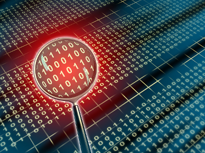

# Reconocimiento de patrones
### Ramón Soto C. [(rsotoc@moviquest.com)](mailto:rsotoc@moviquest.com/)

Este curso ofrece una introducción al área de Reconocimiento de Patrones, con una orientación hacia Data Science, Soft Computing y Minería de opiniones. 

Este es el curso que actualmente imparto en la Lic. en Ciencias de la Computación en la [Universidad de Sonora](www.uson.mx). Los procedimientos están hechos en Python. No se asume un conocimiento profundo, pero tampoco hay una introducción al tema (encontrarán información por todas partes y en particular en el repositorio vecino de [Julio Waissman](https://github.com/juliowaissman/libretasRdP)).
Iremos agregando lecciónes conforme avance el curso. 

La secuencia de temas sugerida es:

* [Intro 1. Bases cognitivas](https://github.com/rsotoc/pattern-recognition/blob/master/Intro%201.%20Bases%20cognitivas.ipynb). Una introducción al tema, enfatizando el reconocimiento de patrones como hanilidad natural.
* [Intro 2. Bases matemáticas](https://github.com/rsotoc/pattern-recognition/blob/master/Intro%202.%20Bases%20matemáticas.ipynb). Sólo por no encontrar un mejor nombre :-), pero es básicamente una discusión de como buscamos sistematizar las tareas de RP, *vectores de características* y discusión inicial de algunos conjuntos de datos de prueba, particularmente el *Pima Indians Diabetes Data Set*. También algunos elementos útiles de Python para análisis de datos.
* [Limpieza de datos I](https://github.com/rsotoc/pattern-recognition/blob/master/Limpieza%20de%20datos%20I.ipynb). Introducción al tema de *preparación de datos*, con énfasis en la *limpieza*. Se analiza el caso de tratamiento de *valores faltantes*.
* [Limpieza de datos II](https://github.com/rsotoc/pattern-recognition/blob/master/Limpieza%20de%20datos%20II.ipynb). Continuación al tema de limpieza de datos. Se discuten el tratamiento a *valores atípicos* y *valores inconsistentes*.
* [Clustering I](https://github.com/rsotoc/pattern-recognition/blob/master/Clustering%20I.ipynb). Introducción al tema y discusión del tema de las *medidas de distanci*a (TODO: omití la discusión de medidas de semejanza a partir de las medidas de distancia :-S). 
* [Clustering II](https://github.com/rsotoc/pattern-recognition/blob/master/Clustering%20II.ipynb). Discusión de los *dendrogramas*: interpretación y construcción.
* K-Means... 
